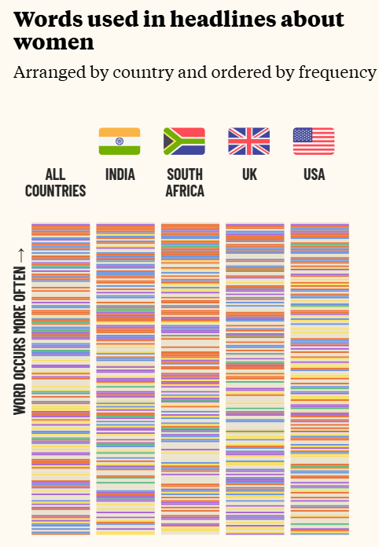
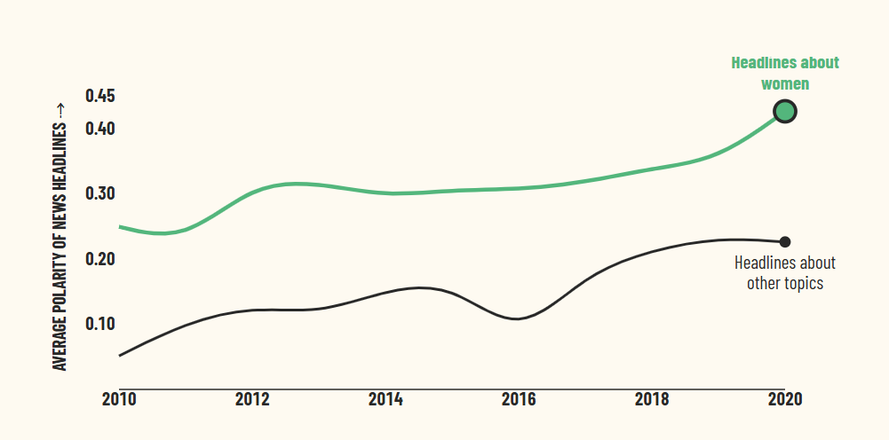
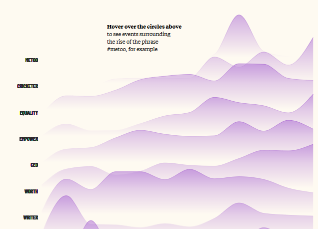
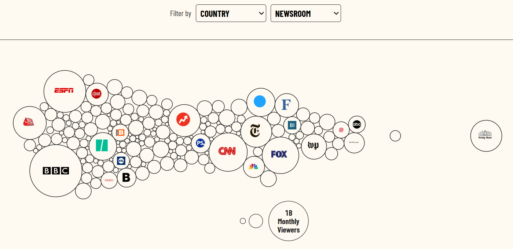
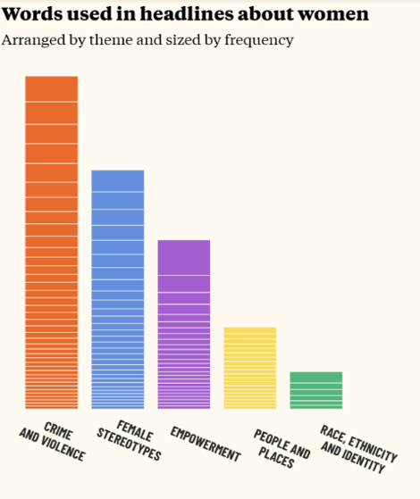

# Tarea 01 Narración Grafica
## [Webstory: When Women Make Headlines: A visual essay about the (mis)representation of women in the news](https://pudding.cool/2022/02/women-in-headlines/)
### Amelie Lefranc V.

## Descripción de la historia que cuenta.
##### Esta webstory escrita por Leonardo Nicoletti y Sahati Sarva presenta resultados de una investigación sobre como las mujeres son representadas o en este caso mal representadas en los medios y titulares de noticias. Para ello, recolectaron más de 382,139 titulares entre los años 2005 y 2021 en países como Estados Unidos, India, Sudáfrica y Reino Unido.  

##### En primera instancia analizaron las palabras más utilizadas en los titulares sobre mujeres, graficando como ciertas expresiones predominan en cada país. Por ejemplo el término “Sue” es más predominante en Estados Unidos mientras que la palabra “Muslim” es más utilizada en titulares de India.

##### Dentro de sus hallazgos destacan la repetición de la palabra “primera” en todos los países señalados. Hay cerca de 8000 titulares que la utilizan para describir o destacar algun aspecto relacionado a una mujer. 

##### Los investigadores también utilizaron el método de clasificar distintas temáticas mediales para recolectar información sobre las palabras más recurrentes. Los resultados arrojaron la temática de “crimen y violencia” como la más predominante acompañada de los términos: “muerte”, “violación”, “asesinato”. 

##### Asimismo, señalaron que estas historias suelen referirse a las mujeres con calificativos como: “madre”, “hija” o “esposa”. Al usar estos términos que muchas veces son innecesarios condicionan la perspectiva de los lectores. Por ejemplo decir “la policía mujer” en vez de decir simplemente policía. Esto influye en como las personas perciben los roles de género y refuerzan estereotipos aún más.
##### Luego de este análisis, los investigadores proponen observar la relación entre titulares y sensacionalismo, y como este aplica a historias sobre mujeres. Al comparar 65 medios en un periodo de 10 años, encontraron que los titulares sobre mujeres son efectivamente más sensacionalistas que otros tópicos. Además, utilizan otra estrategia para medir el grado de polarización de los medios calificándolos entre todos.
##### Una de las ultimas conclusiones a la que llega la webstory es reconocer como los titulares han cambiado en el tiempo, donde es verdad que se ha evidenciado una disminución de palabras estereotípicas que cosifican a la mujer.  Es asi como también identifican que en los últimos años las palabras de empoderamiento han logrado un rol más protagónico. Una posible explicación de este fenómeno es que los cambios en el lenguaje están directamente relacionados con las transformaciones sociales que ocurren en el tiempo. 

## Explica por qué te pareció interesante y qué aspectos destacarías de su estructura narrativa.
##### Me pareció muy interesante la temática abordada por la webstory principalmente porque estudio periodismo y desde que entre a la carrera me han interesado la representación de las mujeres en los medios.  Creo que es importante como esto afecta directamente en temas de sexismo, violencia y estigmatización en la sociedad. Como comunicadora me parece fundamental que se tome en consideración como la prensa genera realidades a través de sus palabras o cobertura de ciertas temáticas. 
##### Encontré genial como los investigadores de la webstory ejecutaron esta hipótesis y como recolectaron los datos para encontrar una respuesta. Lo que mas me gustó fue como abordaron el tema porque no solo se limitaron a analizar las palabras más utilizadas, sino que también examinaron los componentes de un titular y como este funciona. Para mí esto es valioso porque la investigación toma distintos focos que te hacen pensar más allá de lo que te presentan.
##### Sobre el diseño destaco que toda la información está acompañada de herramientas visuales muy descriptivas, fáciles de entender, estéticas y útiles. La buena redacción y datos utilizados generan un estudio muy bien fundamentado y entretenido de leer. Tengo que destacar la última visualización que permite al lector interactuar con una línea de tiempo que además puede aportar al poder sugerir nuevos eventos que quizás no están graficados. 

## Evaluación de la efectividad para transmitir información.

##### Me pareció muy interesante la temática abordada por la webstory principalmente porque estudio periodismo y desde que entre a la carrera me han interesado la representación de las mujeres en los medios.  Creo que es importante como esto afecta directamente en temas de sexismo, violencia y estigmatización en la sociedad. Como comunicadora me parece fundamental que se tome en consideración como la prensa genera realidades a través de sus palabras o cobertura de ciertas temáticas. 
##### Encontré genial como los investigadores de la webstory ejecutaron esta hipótesis y como recolectaron los datos para encontrar una respuesta. Lo que mas me gustó fue como abordaron el tema porque no solo se limitaron a analizar las palabras más utilizadas, sino que también examinaron los componentes de un titular y como este funciona. Para mí esto es valioso porque la investigación toma distintos focos que te hacen pensar más allá de lo que te presentan.
##### Sobre el diseño destaco que toda la información está acompañada de herramientas visuales muy descriptivas, fáciles de entender, estéticas y útiles. La buena redacción y datos utilizados generan un estudio muy bien fundamentado y entretenido de leer. Tengo que destacar la última visualización que permite al lector interactuar con una línea de tiempo que además puede aportar al poder sugerir nuevos eventos que quizás no están graficados. 
